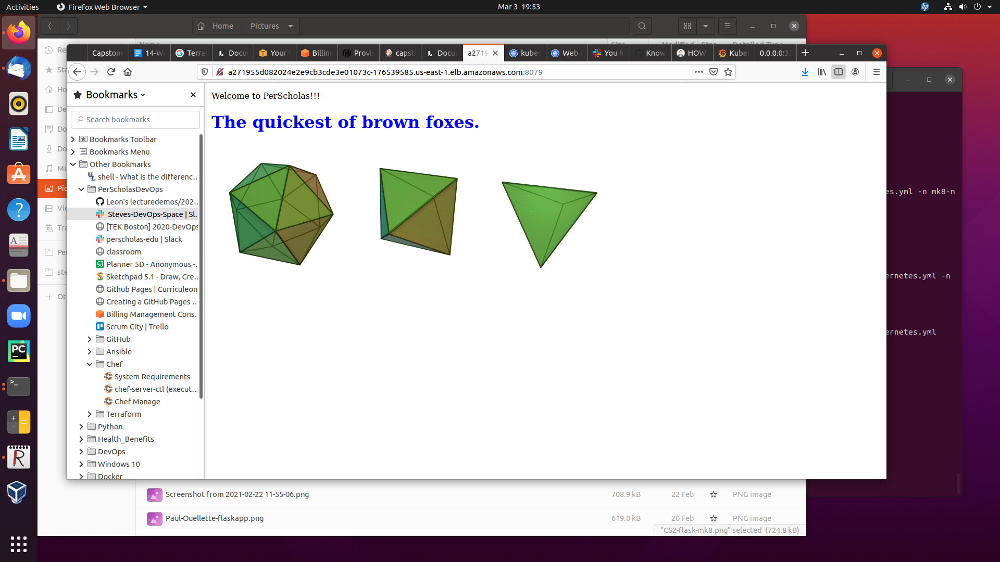
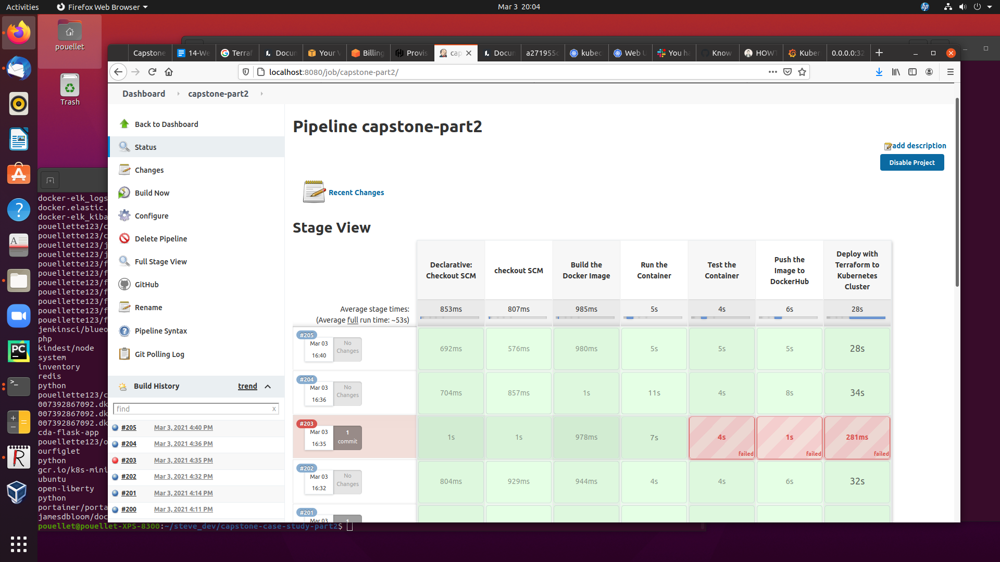

# Capstone Case Study Part 2

### This Project uses a flask application, it builds an image to implement a CI/CD pipeline on a local server using kind and on AWS EKS, both using IaC.

[project description](https://docs.google.com/document/d/1J5rvYyM-EjEq1GFcrTuVrwn6q1INIp6U6J1MS3OhOJM/edit)

[project design document](./Capstone-Case-Study-Part2.jpeg)

## Project File/Directory Structure:

- ``./flask-app`` contains the flask application and Dockerfile used when building the image for the application.
- ``./provision-kubernetes-cluster/provision-cluster.sh`` is a script run to provision the infrastructure. It prompts the user to enter 1 for kind or 2 for AWS eks.
- ``./provision-kubernetes-cluster/kind/`` contains a yml file to provision the infrastructure locally using kind.
- ``./provision-kubernetes-cluster/aws/`` contains Terraform files to provision the infrastructure on AWS eks.
- ``./provision-kubernetes-cluster/config-option.txt`` is a text file that contains a 1, for kind, or a 2 for AWS eks. that signifies the IaC platform to deploy on. The Jenkins pipeline looks at it.
- ``./deploy-kubernetes/kind/`` Terraform files for deploying the Kubernetes service and deployment on a Kind cluster.
- ``./deploy-kubernetes/aws/`` Terraform files for deploying the Kubernetes service and deployment on AWS eks.
- ``./Jenkinsfile`` This is the CI/CD pipeline file/script used by Jenkins to deploy the application. 

## To Implement the CI/CD pipeline on AWS eks or kind

### Prerequisites

- [install kind](https://kind.sigs.k8s.io/docs/user/quick-start/) (kind option only) 
- on AWS create an IAM user, download the .CSV file and place the credentials in the file ~/.aws/credentials on the host you plan on provisioning the eks cluster from (AWS option only)
- a configured AWS CLI (AWS option only)- a DockerHub account
- kubectl
- jenkins with DockerHub and GitHub credentials
- docker
- Terraform

### Steps 

1. git clone this repository
2. run the ``./provision-kubernetes-cluster/provision-cluster.sh`` script and enter 1, for kind, 2 for AWS eks to provision the Kubernetes cluster.
3. create a pipeline in Jenkins using the Jenkins file to build, and deploy the Kubernetes service and deployment.
4. Access the application with by using port 0.0.0.0:30222 using kind and eksdns:8079 on AWS eks. (eksdns can be optained with the command ``kubectl get services`` in the external IP column)

## Monitoring Performed

### kind option

One monitoring suite used: 
1. Grafana and Promethes

One test was performed a few times: 
1. web activity by manually refreshing the web page.

### AWS option

Two tools used to monitor: 
1. ``top`` by attaching to a pod using ``kubectl``
2. AWS eks details and ec2 dashboard

Two tools used to generate activity in the pod: 
1. ``stress`` which didn't put much stress on the system, the CPU went from 0.7% to to less than 50%, AWS eks killed the process for hogging the CPU. The following options were used: ``stress --cpu 8 --io 4 --vm 4 --vm-bytes 1024M --timeout 10s``
2. web activity by manually refreshing the web page caused a pod's CPU to go from 0.7% to 1.3%.

## Screen Shots

### Kubernetes clusters running on local machine

### Kubernetes cluster AWS eks

### flask app running on local machine

### flask app running on AWS eks

### a successful Jenkins pipeline build, test and deployment

### Kubernetes deployment resources running on a local host with some web activity

### Kubernetes deployment networking running on a local host with some web activity

### AWS eks details

### AWS ec2 instance monitoring no activity

### AWS ec2 instance monitoring with web activity (activity probably caused by installing the tool ``stress``)

### AWS ec2 instance monitoring with top no stress

### AWS ec2 instance monitoring with top and stress by manual web activity

### AWS ec2 instance monitoring with top and stress by running ``stress twice``

## Issues encountered

- Have been using ``git clone`` instead of ``git checkout`` in the Jenkinsfile. This option wipes out the Terraform files saved after the initial deployment. These files are required when deploying a second time because you are not deleting the existing deployment, which you shouldn't. ``git checkout`` is now being used but not fully tested, ran out of time.
- Can't get the **Slack Notification** plugin in Jenkins. Tried multiple options but couldn't get the plugin to show up. It does show up in the Jenkins I  have running in a Docker container, but I didn't have time to transition to that option. Also thought of reinstalling Jenkins on my computer. No time to puruse that in case it introduced more issues.
- To access AWS eks from the public end, you have to implement a service with type LoadBalancer. ClusterIP and NodePort won't work.
- Be careful when running with multiple Kubernetes contexts and/or users when it comes to credentials for AWS and Kubernetes.
- metricbeats Kubernetes module difficult to implement.
-  
